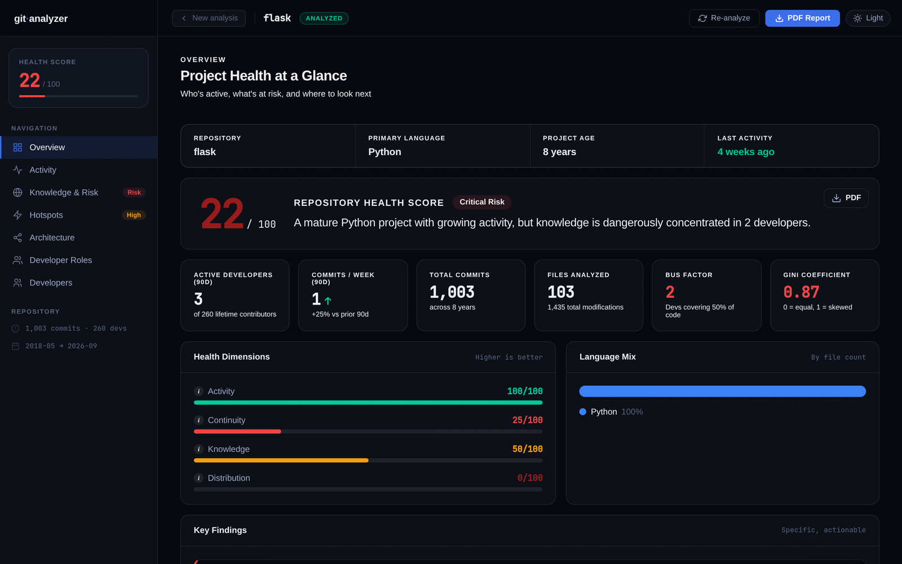
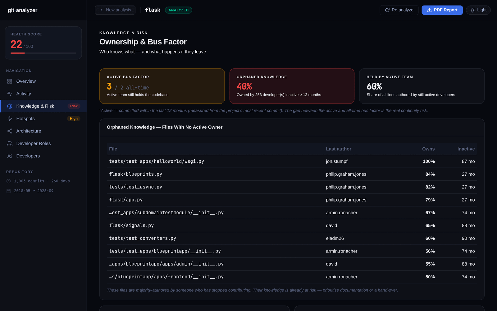
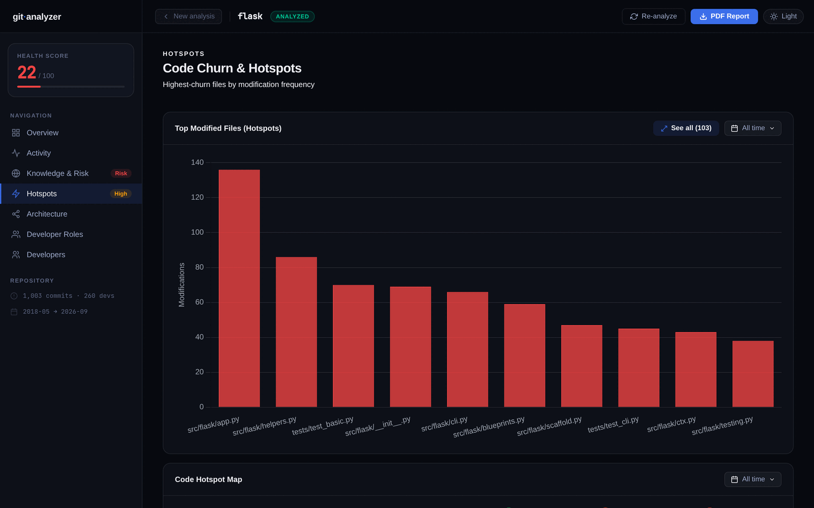
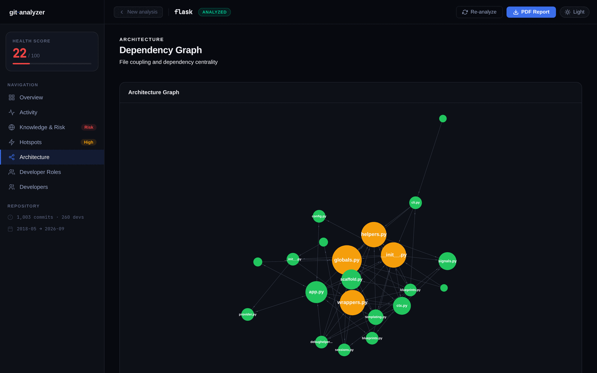
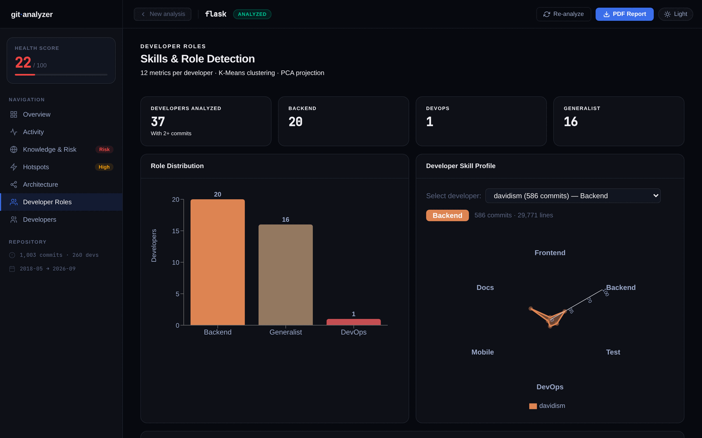

<div align="center">

# Git Analyzer

**Know who knows your code, before they leave.**

Bus factor, knowledge concentration, orphaned code, hotspots, architecture risk
and developer roles for any Git repository, right inside VS Code.

*100% local. Your code and your team's data never leave your machine.*

</div>



## Why Git Analyzer

Every codebase has files that only one person understands. When that person
leaves, the knowledge leaves with them. Git Analyzer reads your commit history
and shows where that risk is, how bad it is, and what to do about it.

## Features

| | |
|---|---|
| **Health score** | A single 0–100 score built from activity, continuity, knowledge spread and distribution, with plain-language findings and recommendations. |
| **Bus factor** | Active and all-time bus factor, so you see the gap between who *committed* and who is *still here*. |
| **Knowledge & risk** | Orphaned files with no active owner, ownership percentages, and the share of code held by the active team. |
| **Hotspots** | The most frequently modified files and a code hotspot map, to spot churn and fragile areas. |
| **Architecture** | A file dependency graph that highlights central, highly coupled modules. |
| **Developer roles** | Each developer's role (Backend, Frontend, DevOps, Test, Docs, Mobile, Generalist) inferred from 12 metrics using K-Means clustering. |
| **Developers** | Per-developer profile: activity over time, risk exposure, top owned files. |
| **PDF health report** | A shareable report with score, insights and recommendations. |
| **CSV export** | "See all" tables with search, sorting and CSV export. |
| **Time filters** | Date ranges with comparison to the previous period or the previous year. |

## Screenshots

### Knowledge & Risk: who owns what, and what is orphaned


### Hotspots: where the churn is


### Architecture: how files depend on each other


### Developer roles: what each person actually does


*Screenshots show an analysis of the open-source [pallets/flask](https://github.com/pallets/flask) repository.*

## Getting started

1. Open a folder that is a Git repository.
2. Click the **Git Analyzer** icon in the activity bar, then **▶ Analyze**.
3. The first time, the extension offers to **set up its analysis engine**: it
   installs the Python packages it needs into a private environment (once;
   about 200 MB download, 600 MB on disk; needs Python 3.11+ and internet).

Re-run with **Re-analyze**. An unchanged repository reopens instantly, and a
new commit triggers a fresh analysis automatically.

Also available from the Command Palette (`Ctrl+Shift+P`): *Git Analyzer: Analyze
Repository*, *Open Dashboard*, *Re-analyze*, *Set Up Analysis Engine*, *Show Engine Log*.

## In the editor

- **Sidebar**: repository summary, developers with their roles, and the riskiest files.
- **Status bar**: health score and bus factor of the last analysis at a glance.
- **Dashboard**: the same dashboard as the Git Analyzer website and desktop app,
  powered by the same analysis engine, so results match exactly.

## Requirements

- **Git** on your PATH.
- **Python 3.11+** (tested on 3.13 and 3.14), or the Git Analyzer desktop app's
  engine via `githubAnalyzer.enginePath`, in which case no Python is needed.

## Settings

| Setting | Default | Description |
|---|---|---|
| `githubAnalyzer.pythonPath` | empty | Python to run the engine with. Empty uses the private environment or `python3`. |
| `githubAnalyzer.enginePath` | empty | Path to a frozen `analyzer_bridge` engine binary. |

## Privacy

The analysis reads your **local repository only**. The extension makes no
network requests during analysis, and nothing is uploaded. Profile pictures are
not fetched in VS Code.

## How it works

Git Analyzer analyses the **committed state of the checked-out branch**, so
`node_modules`, virtual environments and uncommitted edits never skew the
results. Ownership is computed from line-level blame, roles from commit-based
behavioural metrics, and risk from how concentrated knowledge is among people
who are still active.

## Feedback

Found a bug or have an idea? [Open an issue](https://github.com/othmxnee/github-analyzer/issues).

## Build from source

```bash
npm run prepare-assets   # builds the dashboard + copies the engine sources
npm run package          # creates the .vsix
```

## License

MIT
